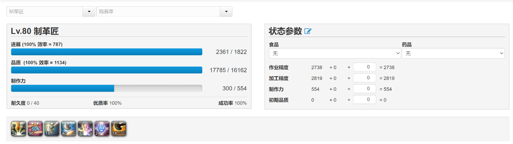

<span style='color:b;font-size:30px;font-family:字体;'>**前言**</span>


应<span style='color:red;font-size:;font-family:字体;'>**猫猫 无颜之月@梦羽宝境 **</span>的要求，本着一步到位的原则（避免受苦），结合国际服5.4战斗职业新装备等情报，将5.3生产采集新装备相关技巧与经验整理汇总如下。

<span style='color:b;font-size:30px;font-family:字体;'>**月下版禁断方案（厨子除外）**</span>

前人栽树，后人乘凉，首先需要月下版禁断方案。

[https://asvel.github.io/ffxiv-gearing/?1p1tl3tK58y6PsrgHaY6aSW33K1XvdSkt044ndgU6lpYfpR6UY7do93kPmw]: 


------

<span style='color:b;font-size:30px;font-family:字体;'>**宏**</span>

*然后就可以用宏愉快的制作了（*

 <span style='color:red;font-size:20px;font-family:字体;'>**喝抹茶HQ的490 18步量产宏**</span>

```
 
/ac 闲静 <wait.3>
/ac 掌握 <wait.2>
/ac 改革 <wait.2>
/ac 长期俭约 <wait.2>
/ac 坯料加工 <wait.3>
/ac 坯料加工 <wait.3>
/ac 坯料加工 <wait.3>
/ac 崇敬 <wait.2>
/ac 坯料制作 <wait.3>
/ac 坯料制作 <wait.3>
/ac 坯料制作 <wait.3>
/ac 精密制作 <wait.3>
/ac 阔步 <wait.2>
/ac 改革 <wait.2>
/ac 坯料加工 <wait.3>
/ac 阔步 <wait.2>
/ac 比尔格的祝福 <wait.3>
/ac 制作

```


 

------

<span style='color:red;font-size:20px;font-family:字体;'>**480量产一步宏**</span>

```
/ac 闲静 <wait.3>
/ac 掌握 <wait.2>
/ac 崇敬 <wait.2>
/ac 长期俭约 <wait.2>
/ac 坯料制作 <wait.3>
/ac 坯料制作 <wait.3>
/ac 模范制作 <wait.3>
/ac 坯料加工 <wait.3>
/ac 坯料加工 <wait.3>
/ac 改革 <wait.2>
/ac 坯料加工 <wait.3>
/ac 坯料加工 <wait.3>
/ac 阔步 <wait.2>
/ac 比尔格的祝福 <wait.3>
/ac 坯料制作
```


------

 <span style='color:red;font-size:20px;font-family:字体;'>**星级半成品平推**</span>

```

/ac 坚信 <wait.3>
/ac 崇敬 <wait.2>
/ac 坯料制作 <wait.3>
/ac 模范制作

```


------

 <span style='color:red;font-size:20px;font-family:字体;'>**富婆衣（适用于5.4版本及之前版本）**</span>

```

/ac 闲静 <wait.3>
/ac 掌握 <wait.2>
/ac 长期俭约 <wait.2>
/ac 精密制作 <wait.3>
/ac 坯料加工 <wait.3>
/ac 改革 <wait.2>
/ac 坯料加工 <wait.3>
/ac 坯料加工 <wait.3>
/ac 阔步 <wait.2>
/ac 比尔格的祝福 <wait.3>
/ac 崇敬 <wait.2>
/ac 坯料制作 <wait.3>
/ac 坯料制作 <wait.3>
/ac 坯料制作

```


------

 <span style='color:red;font-size:20px;font-family:字体;'>**非专家需求辣蟹HQ魔匠药水HQ垫6546品质的510HQ 20步量产宏**</span>

```

/ac 坚信 <wait.3>
/ac 内静 <wait.2>
/ac 掌握 <wait.2>
/ac 崇敬 <wait.2>
/ac 长期俭约 <wait.2>
/ac 坯料制作 <wait.3>
/ac 坯料制作 <wait.3>
/ac 精密制作 <wait.3>
/ac 改革 <wait.2>
/ac 坯料加工 <wait.3>
/ac 坯料加工 <wait.3>
/ac 坯料加工 <wait.3>
/ac 坯料加工 <wait.3>
/ac 阔步 <wait.2>
/ac 改革 <wait.2>
/ac 坯料加工 <wait.3>
/ac 阔步 <wait.2>
/ac 比尔格的祝福 <wait.3>
/ac 观察 <wait.3>
/ac 注视制作

```


------

 <span style='color:red;font-size:20px;font-family:字体;'>**专家需求辣蟹HQ魔匠药水HQ垫2399品质的510HQ 27步量产宏**</span>

```

/ac 坚信 <wait.3>
/ac 内静 <wait.2>
/ac 掌握 <wait.2>
/ac 崇敬 <wait.2>
/ac 俭约 <wait.2>
/ac 坯料制作 <wait.3>
/ac 坯料制作 <wait.3>
/ac 精密制作 <wait.3>
/ac 坯料加工 <wait.3>
/ac 改革 <wait.2>
/ac 俭约加工 <wait.3>
/ac 俭约加工 <wait.3>
/ac 俭约加工 <wait.3>
/ac 俭约加工 <wait.3>
/ac 改革 <wait.2>
/ac 俭约加工 <wait.3>
/ac 俭约加工 <wait.3>
/ac 观察 <wait.3>
/ac 注视加工 <wait.3>
/ac 阔步 <wait.2>
/ac 改革 <wait.2>
/ac 观察 <wait.3>
/ac 注视加工 <wait.3>
/ac 阔步 <wait.2>
/ac 比尔格的祝福 <wait.3>
/ac 观察 <wait.3>
/ac 注视制作

```


------

 <span style='color:red;font-size:20px;font-family:字体;'>**76,78级的成品HQ配方，黄票专用**</span>

```

/ac 闲静 <wait.3>
/ac 精密制作 <wait.3>
/ac 精密制作 <wait.3>
/ac 坯料加工 <wait.3>
/ac 比尔格的祝福 <wait.3>
/ac 坯料制作

```


------

 <span style='color:red;font-size:20px;font-family:字体;'>**80级的成品HQ配方，白票专用**</span>

```

/ac 闲静 <wait.3>
/ac 改革 <wait.2>
/ac 坯料加工 <wait.3>
/ac 崇敬 <wait.2>
/ac 精密制作 <wait.3>
/ac 精密制作 <wait.3>
/ac 比尔格的祝福 <wait.3>
/ac 坯料制作

```


------

 <span style='color:red;font-size:20px;font-family:字体;'>**78级HQ半成品，510HQ垫品质のためにBりましょう**</span>

```

/ac 闲静 <wait.3>
/ac 长期俭约 <wait.2>
/ac 加工 <wait.3>
/ac 坯料加工 <wait.3>
/ac 阔步 <wait.2>
/ac 比尔格的祝福 <wait.3>
/ac 坯料制作

```




------


<span style='color:b;font-size:30px;font-family:字体;'>**专家特化厨子禁断**</span>

接下来是根据月下方案改造厨子主副手并且需要专家的特化食物垫品质一步宏。简单来说就是高作业。

[https://asvel.github.io/ffxiv-gearing/?bufdonNr5Dsw4z8ji0dJpt1fQGUC1JhTyWanitJNgUCGqndaRD9NjFGc91idvZsprUud2PwLMfGOJFH]: 


<span style='color:b;font-size:30px;font-family:字体;'>**专家特化厨子禁断专用宏**</span>

 <span style='color:red;font-size:20px;font-family:字体;'>**特化厨子专家需求h黄心薯HQ垫7147品质的3.5星食物一步宏**</span>

```

/ac 闲静 <wait.3>
/ac 掌握 <wait.2>
/ac 崇敬 <wait.2>
/ac 长期俭约 <wait.2>
/ac 坯料制作 <wait.3>
/ac 坯料制作 <wait.3>
/ac 坯料制作 <wait.3>
/ac 坯料加工 <wait.3>
/ac 坯料加工 <wait.3>
/ac 改革 <wait.2>
/ac 坯料加工 <wait.3>
/ac 坯料加工 <wait.3>
/ac 阔步 <wait.2>
/ac 比尔格的祝福 <wait.3>
/ac 精密制作

```


------

 <span style='color:red;font-size:20px;font-family:字体;'>**特化厨子专家需求h黄心薯HQ名匠药水HQ垫18300品质的4星食物一步宏**</span>

```

/ac 闲静 <wait.3>
/ac 掌握 <wait.2>
/ac 崇敬 <wait.2>
/ac 长期俭约 <wait.2>
/ac 坯料制作 <wait.3>
/ac 坯料制作 <wait.3>
/ac 坯料制作 <wait.3>
/ac 坯料加工 <wait.3>
/ac 坯料加工 <wait.3>
/ac 改革 <wait.2>
/ac 坯料加工 <wait.3>
/ac 坯料加工 <wait.3>
/ac 阔步 <wait.2>
/ac 比尔格的祝福 <wait.3>
/ac 坯料制作

```


------

<span style='color:b;font-size:30px;font-family:字体;'>**采集禁断**</span>

适用于第三期伊修加德的三线高配方案，兼顾省钱。


以上（


<p align="left">抄作业课代表：猫猫 无颜之月@梦羽宝境</p>


<p align="right" >整理：猛1 Mokiu丶@白金幻象</span></p>


